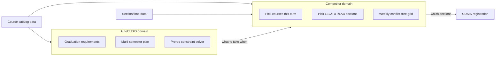
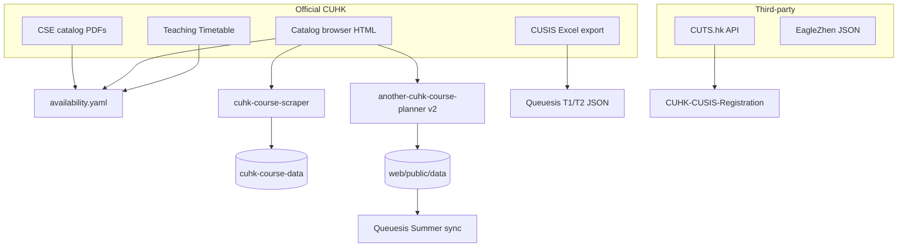
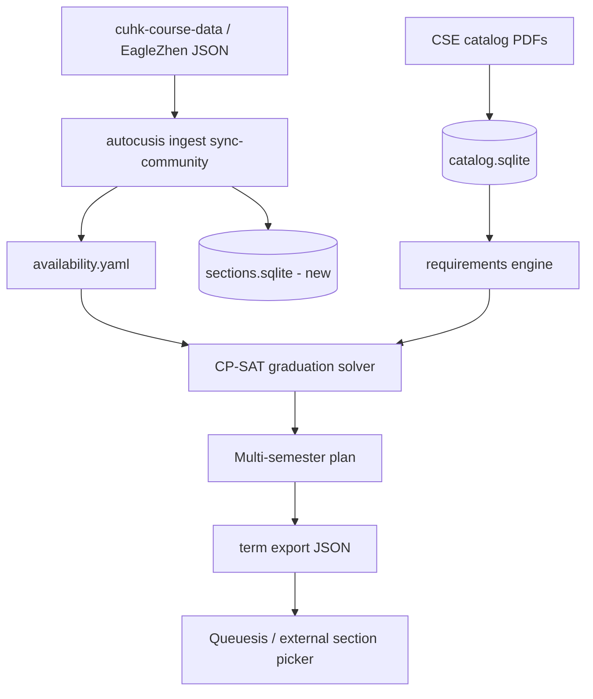

# AutoCUSIS vs CUHK Competitor Analysis

**Date:** June 2026  
**Repos cloned to:** `/Users/youwen/Projects/CLONED`  
**Strategy:** Graduation planning (CP-SAT) as core moat; adopt competitor patterns only for data/UX gaps.

---

## 1. Executive Summary

AutoCUSIS and the three named competitors (plus their upstream data repos) solve **adjacent problems** in the CUHK course-selection stack. They are not direct substitutes.

| Question | AutoCUSIS | Queuesis / CUtopia / CUHK-CUSIS-Registration |
|----------|-----------|-----------------------------------------------|
| What courses over the next N semesters to graduate? | **Yes** (CP-SAT) | **No** |
| Which LEC/TUT/LAB sections fit my week this term? | **No** | **Yes** |
| Course reviews and community adoption? | **No** | CUtopia only |
| Live seat availability? | **No** | Queuesis, EagleZhen data |

**Verdict:** AutoCUSIS is the only tool among these that answers *"what should I take over the next N semesters to graduate under degree rules?"* None of the competitors ship a graduation-requirement DSL, multi-semester solver, or prerequisite AST enforcement. Queuesis explicitly lists degree-path planning as **unchecked future roadmap work**.

The correct strategy is **not** to pivot into becoming Queuesis. It is to:

1. Keep CP-SAT graduation planning as the moat.
2. Replace manual availability ingestion with community course data.
3. Bridge graduation plans to external section schedulers (Queuesis / EagleZhen format).
4. Tighten solver honesty defaults.



---

## 2. Feature Matrix

### 2.1 Problem domain and solver

| Project | Primary job | Horizon | Algorithm | UI |
|---------|-------------|---------|-----------|-----|
| **AutoCUSIS** | Graduate on time under degree rules | Multi-year | OR-Tools CP-SAT (lexicographic 3-stage) | CLI |
| **Queuesis** | Best weekly timetable for chosen courses | Single term | Backtracking + heuristic scoring (~1500 LOC) | Next.js web |
| **CUtopia** | Course reviews + timetable planning | Single term | Manual + conflict detection only | Full-stack web |
| **CUHK-CUSIS-Registration** | Optimal section combo for a course list | Single term | Recursive bruteforce + hand-tuned rating | Jupyter notebook |

### 2.2 Data pipeline

| Project | Catalog source | Section/time data | Seats | Prereqs | Update workflow |
|---------|---------------|-------------------|-------|---------|-----------------|
| **AutoCUSIS** | CSE PDFs + saved catalog HTML → SQLite | Teaching Timetable HTML → `availability.yaml` (T1/T2 flags only) | No | Parsed boolean AST | Per-course ingest + manual YAML |
| **Queuesis** | CUSIS Excel export | Full sections in JSON/MongoDB | Yes (`quota`, `seatsRemaining`) | Empty arrays (not populated) | `convert-excel.ts`, `sync-github-courses.ts` |
| **CUtopia** | Official catalog scraper → `cuhk-course-data` submodule | Nested term/section dict | No | Free-text `requirements` | `yarn load-data` (submodule pull) |
| **cuhk-course-data** | Same as CUtopia scraper | Same legacy schema | No | Free-text | Scraper rerun + git commit |
| **another-cuhk-course-planner** | Official catalog scraper v2 | `schedule[]` + `meetings[]` + `availability` | Yes | `enrollment_requirement` text | `scrape_all_subjects.py` → publish |
| **CUHK-CUSIS-Registration** | **Third-party CUTS.hk API** | Slot grid (6×10 periods) | Partial (`quota`) | None | Notebook + CSV cache |

### 2.3 Graduation / degree requirements

| Feature | AutoCUSIS | Queuesis | CUtopia | CUHK-CUSIS-Reg | EagleZhen | cuhk-course-data |
|---------|-----------|----------|---------|----------------|-----------|------------------|
| Requirement DSL (`all_of`, `credits_from`) | **Yes** | No | No | No | No | No |
| Multi-semester plan solver | **Yes** | No | No | No | No | No |
| Progress tracking (`autocusis status`) | **Yes** | No | No | No | No | No |
| Prereq AST in planning | **Yes** | No | No | No | No | No |
| CP-SAT / OR-Tools | **Yes** | No | No | No | No | No |
| Degree path on roadmap | N/A (shipped) | **Unchecked** | No | No | Product question only | N/A |

**Queuesis roadmap evidence** (`/Users/youwen/Projects/CLONED/Queuesis/README.md`):

```
- [ ] **Intelligence Features**
  - ML-based schedule recommendations
  - Optimal path planning for degree requirements
```

**EagleZhen product question** (`another-cuhk-course-planner/web/src/lib/analytics.ts`):

```typescript
// Key decisions: Focus on current term UX vs multi-semester planning features?
```

### 2.4 UX and adoption

| Dimension | AutoCUSIS | Queuesis | CUtopia | CUHK-CUSIS-Reg |
|-----------|-----------|----------|---------|----------------|
| Web UI | None | Deployed, dark mode | cutopia.app, thousands of users | None |
| Drag-and-drop timetable | No | Yes | Yes | No |
| Export ICS/calendar | No | Yes | Yes | Excel |
| Conflict detection | No (semester-level) | Real-time | Real-time | During search |
| Preference modes | 3-stage lexicographic objective | 6 lifestyle modes | None (manual) | 1 heuristic rating |
| Tests on scheduler | pytest (solver) | Jest (comprehensive) | Minimal | None |

---

## 3. AutoCUSIS Advantages (Keep and Double Down)

### 3.1 Only real graduation solver in the field

AutoCUSIS uses Google OR-Tools CP-SAT with a formal constraint model:

```1:22:autocusis/scheduler/solver.py
"""CP-SAT study-plan scheduler.

Builds a constraint model that assigns each outstanding course to a planning
slot (year + term) subject to:
  * prerequisite ordering (a course's prereq AST must be satisfied by courses
    scheduled in strictly earlier slots, or already completed),
  * mutual exclusions,
  * term availability (a course only in the terms it is offered),
  * per-term and per-year credit caps,
  * priority pins (a course fixed to a specific slot),
  * requirement satisfaction (mandatory courses taken; elective pools filled to
    their credit/count floor; free-elective credit gaps filled with generic
    placeholder courses).

Objective is lexicographic (multi-objective):
  1. minimize the finishing term (fastest graduation),
  2. minimize the peak per-term credit load (balanced load),
  3. minimize total earliness index (gentle tie-break toward earlier terms).
```

Competitors use combinatorial backtracking with hand-tuned scores (Queuesis, Gameboy612) or no automation at all (CUtopia). None model curriculum satisfaction.

### 3.2 Prerequisite boolean expressions

AutoCUSIS parses prereqs into an AST (`autocusis/ingest/prereq.py`) and compiles them into CP-SAT implications in the solver. Competitors store prereqs as display strings—or leave them empty (Queuesis sync sets `prerequisites: []`).

### 3.3 Multi-semester credit budgeting

Per-term (default 18) and per-year (default 39) caps, priority pins, elective pool filling, and free-elective placeholders are unique to AutoCUSIS. No competitor models credit load across years.

### 3.4 Requirement progress reporting

The YAML DSL in `data/requirements/aist.yaml` with `all_of`, `credits_from`, and `count_from` groups, evaluated by `autocusis/requirements/engine.py`, has no equivalent in any competitor.

### 3.5 Offline, auditable, no server

Data lives in local YAML and SQLite. CUtopia/Queuesis require hosted infrastructure (MongoDB, Vercel) or community JSON snapshots.

---

## 4. AutoCUSIS Gaps (Ruthless)

### 4.1 Wrong abstraction layer for "registration"

Plans output *"take AIST3010 in Y2T1"* with no LEC/TUT/LAB assignment, no Tuesday-8:30am check, no lunch-gap preference. Students still do all hard work in CUSIS. The name **AutoCUSIS** oversells and underserves.

### 4.2 Data pipeline is the weakest link

Manual `availability.yaml` curation, incomplete Playwright stub, ~90 hand-saved HTML files—while Queuesis ships `courses-2025-26-T2.json` (114k+ lines, full sections) and `cuhk-course-data` updates through 2025. The hybrid PDF/HTML doctrine is intellectually correct but **operationally exhausting**.

Evidence: most entries in `data/availability.yaml` have `terms: []` with only manual notes.

### 4.3 No section-level conflict detection

The #1 student pain point each registration period. AutoCUSIS deliberately operates at semester granularity. `timetable_scraper.py` only extracts *which terms* a course is offered—not section times.

### 4.4 Garbage-in defaults

`assume_unknown_available=True` and unparseable prereqs treated as satisfied produce confidently wrong plans. Competitors at least show actual section times for eyeball validation.

### 4.5 Zero UX surface

CUtopia: reviews + planner + production infra. Queuesis: drag-and-drop + 6 preference modes + ICS export. AutoCUSIS: Rich tables in a terminal. Solver quality does not drive adoption without a surface.

### 4.6 Single-program shipping default

AIST YAML is thorough (~300 lines) but competitors serve all departments via bulk course data (~250 subject files in `cuhk-course-data`).

### 4.7 No seat/capacity awareness

Queuesis filters full sections (`seatsRemaining: 0`). AutoCUSIS plans courses that may be impossible to enroll in.

---

## 5. Competitor Weaknesses (Why Not Pivot)

### 5.1 CUHK-CUSIS-Registration (Gameboy612)

| Aspect | Assessment |
|--------|------------|
| Scope | Single Jupyter notebook + `modules/bruteforce.py` |
| Data | Third-party CUTS.hk API—not official, brittle |
| Algorithm | Full recursive bruteforce; **random noise** in scoring (`random.randint(0, 1000)`) |
| Scale | Exponential; no pruning memoization |
| Maintenance | 1 star; no tests |
| Graduation | None |

**Verdict:** Not worth adopting as a platform. Only the **scoring heuristics** (free day, lunch gap, lesson count) are worth studying for a future `autocusis sections` command.

### 5.2 Queuesis

| Aspect | Assessment |
|--------|------------|
| Engineering | Best of the three for section scheduling; tested, deployed |
| Scope | Single-term only |
| License | **AGPL-3.0**—viral if embedded |
| Data | Still depends on EagleZhen scraper (Phase 2 native scraper unfinished) |
| Graduation | Roadmap vaporware |
| Prereqs | Schema exists but sync always sets `prerequisites: []` |

**Verdict:** Best section scheduler, but not a graduation tool. Use as a **bridge target**, not a replacement. Do not embed AGPL code.

### 5.3 CUtopia

| Aspect | Assessment |
|--------|------------|
| Adoption | Thousands of users; course reviews are the real moat |
| Planner | Manual only—no auto-combination, no ranking |
| Stack | Monorepo + GraphQL + MobX—heavy |
| Freshness | Last app push Aug 2024 |
| Data | No seat counts; legacy nested-dict schema |
| Graduation | None |

**Verdict:** Best data ecosystem and user base for catalog browsing, but won't solve graduation planning. **`cuhk-course-data` submodule is the valuable artifact**, not the planner code.

---

## 6. Algorithm Comparison (Detail)

### 6.1 Queuesis — backtracking + heuristic scoring

- **Search:** Recursive backtracking with early conflict pruning; cap at `max(maxResults × 40, 4000)` valid schedules.
- **Constraints:** Time overlap, LEC→TUT/LAB linkage, optional full-section filter.
- **Objectives:** 6 preference modes (`shortBreaks`, `longBreaks`, `consistentStart`, `startLate`, `endEarly`, `daysOff`) via weighted metrics on gaps, free days, campus span.
- **Cannot do:** Prerequisites, exclusions, credit caps, multi-term horizon, curriculum pools.

Key file: `/Users/youwen/Projects/CLONED/Queuesis/src/lib/schedule-generator.ts`

### 6.2 CUHK-CUSIS-Registration — grid bruteforce

- **Search:** Recursive DFS over section variants on a 6-day × 10-period grid.
- **Scoring:** Hand-tuned bonuses/penalties; `NO_LUNCH_PENALTY = -30000`; random tie-break.
- **Cannot do:** Minute-level times, prereqs, degree rules, deterministic optimality.

Key file: `/Users/youwen/Projects/CLONED/CUHK-CUSIS-Registration/bruteforce.ipynb`

### 6.3 CUtopia — manual + conflict detection

- **Search:** None. User picks sections; MobX store computes O(n²) time overlaps.
- **Cannot do:** Any automation, ranking, or preference optimization.

Key files: `CUtopia/frontend/src/store/PlannerStore.ts`, `frontend/src/helpers/timetable.ts`

### 6.4 AutoCUSIS — CP-SAT degree planner

- **Search:** CP-SAT with 8 workers, 15s time limit per stage, lexicographic lock + no-good cuts for alternates.
- **Constraints:** Prereq AST, exclusions, availability, credit caps, pins, elective pools, filler courses.
- **Cannot do:** Weekly section assignment, lifestyle preferences, seat filtering.

### 6.5 Complementary layers

1. **AutoCUSIS** — What courses, in which semesters, to graduate?
2. **Queuesis / bruteforce** — Given those courses this term, which section combo fits my week?
3. **CUtopia** — Let me build and share a timetable manually with conflict warnings.

A full registration assistant needs **both** solvers. AutoCUSIS does not substitute for Queuesis-style section scheduling.

---

## 7. Data Pipeline Lineage



### Schema snapshots

**Queuesis** (`courses-2025-26-T2.json`):

```json
{
  "courseCode": "ACCT1111",
  "credits": 3,
  "prerequisites": [],
  "sections": [{
    "sectionId": "D",
    "sectionType": "Lecture",
    "timeSlots": [{ "day": "Thursday", "startTime": "09:30", "endTime": "12:15" }],
    "quota": 70,
    "seatsRemaining": 38
  }],
  "term": "2025-26-T2"
}
```

**EagleZhen v2** (`web/public/data/CSCI.json`):

```json
{
  "subject": "CSCI",
  "course_code": "1020",
  "terms": [{
    "term_name": "2025-26 Term 2",
    "schedule": [{
      "section": "--LEC (6161)",
      "meetings": [{ "time": "Th 1:30PM - 2:15PM", "location": "..." }],
      "availability": { "capacity": "50", "available_seats": "21" }
    }]
  }]
}
```

**CUtopia legacy** (`cuhk-course-data/courses/CSCI.json`):

```json
{
  "code": "1020",
  "requirements": "Not for students who have taken CSCI1120...",
  "terms": {
    "2025-26 Term 2": {
      "--LEC (6161)": {
        "days": [4],
        "startTimes": ["13:30"],
        "endTimes": ["14:15"]
      }
    }
  }
}
```

**AutoCUSIS** (`availability.yaml`):

```yaml
courses:
  AIST3010:
    terms: [1]
    source: manual
    note: "Term 1 only"
```

---

## 8. Actionable Adoption List (Ranked)

| Priority | Action | Impact | Effort | Notes |
|----------|--------|--------|--------|-------|
| **P0** | Community data adapter for availability | High | Medium | See `docs/community-data-adapter-design.md` |
| **P0** | Tighten solver honesty (`--strict`, warn on unknown availability) | High | Low | Flip or flag `assume_unknown_available` |
| **P1** | `autocusis plan --export-term-courses` → Queuesis/EagleZhen JSON | Medium | Low | Bridge, don't rebuild scheduler |
| **P1** | Surface unparseable prereqs in plan output | Medium | Low | Actionable warnings |
| **P2** | `--export-ics` for calendar apps | Medium | Medium | Match Queuesis export parity |
| **P2** | Optional `sections.sqlite` from community data | Medium | Medium | Enables future `autocusis sections` |
| **P3** | Extract lifestyle heuristics from Gameboy612/Queuesis | Low | Medium | For one-term section picker only |
| **Never** | Embed Queuesis AGPL code | — | — | License trap |
| **Never** | Depend on CUTS.hk API | — | — | Unofficial, brittle |
| **Never** | Rebuild CUtopia monorepo / MongoDB stack | — | — | Overkill for CLI |
| **Never** | Pivot away from CP-SAT graduation planning | — | — | Uncontested moat |

---

## 9. Proposed Architecture After Adoption



---

## 10. Cloned Repo Reference

| Repo | Path | Role |
|------|------|------|
| CUHK-CUSIS-Registration | `/Users/youwen/Projects/CLONED/CUHK-CUSIS-Registration` | Bruteforce notebook + CUTS API |
| Queuesis | `/Users/youwen/Projects/CLONED/Queuesis` | Section scheduler web app |
| CUtopia | `/Users/youwen/Projects/CLONED/CUtopia` | Reviews + manual planner |
| cuhk-course-data | `/Users/youwen/Projects/CLONED/cuhk-course-data` | CUtopia published catalog |
| another-cuhk-course-planner | `/Users/youwen/Projects/CLONED/another-cuhk-course-planner` | EagleZhen v2 scraper + data |

---

## 11. Key AutoCUSIS Files

| Concern | File |
|---------|------|
| Graduation solver | `autocusis/scheduler/solver.py` |
| Requirement DSL | `data/requirements/aist.yaml` |
| Progress engine | `autocusis/requirements/engine.py` |
| Catalog ingest | `autocusis/ingest/pdf_parser.py` |
| Availability store | `autocusis/ingest/availability_store.py` |
| Timetable scrape | `autocusis/ingest/timetable_scraper.py` |
| Prereq parser | `autocusis/ingest/prereq.py` |
